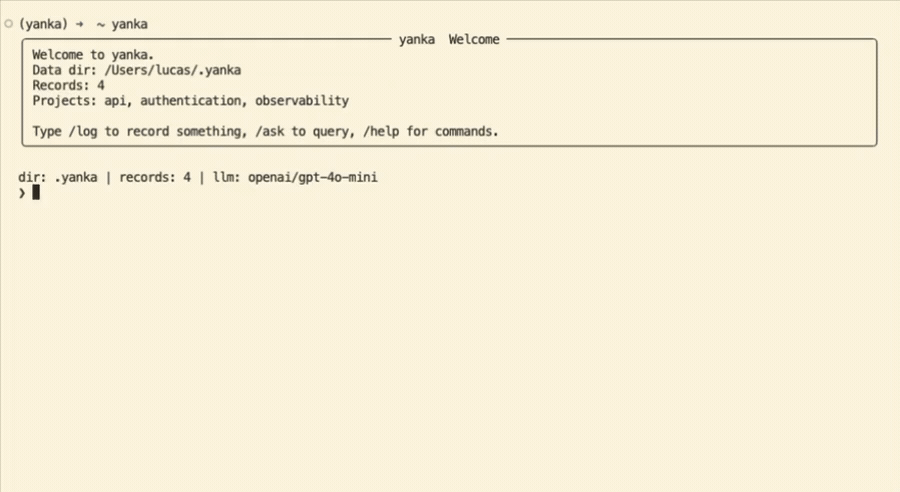
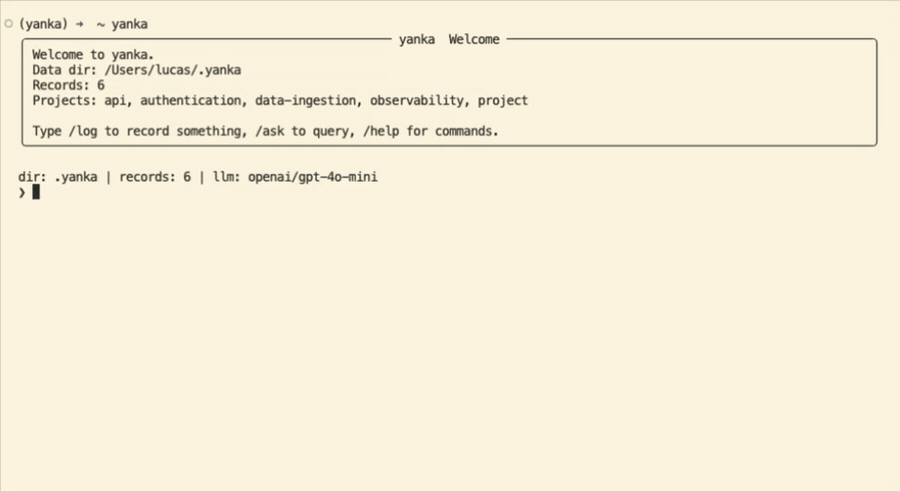

# yanka

<p align="left">
  <a href="https://pypi.org/project/yanka/"></a>
  <a href="https://pypi.org/project/yanka/"></a>
  <a href="https://github.com/Nambu14/yanka/actions/workflows/ci.yml"></a>
  <a href="https://github.com/Nambu14/yanka/blob/main/LICENSE"></a>
  <a href="https://github.com/Nambu14/homebrew-yanka"></a>
</p>

**Remember why you made engineering decisions.**

Yanka is a local-first CLI for your own engineering memory. `/log` while the context is fresh; `/ask` months later and get the why back with citations. Records are markdown on disk — portable, inspectable, rebuildable.

## Try it

```bash
pip install yanka
yanka
```

Python 3.12+. First run: pick a data directory and LLM provider, then you're in the REPL. Paste this:

```text
/log We moved auth session storage from Redis to Postgres so ops is simpler and debugging is SQL-first.
/ask Why did we move auth session storage to Postgres?
```

## Demo

**/log** — brain dump, a few clarifying questions, structured record



**/ask** — plain English, cited answer from your records



## Commands

| Command | What it does |
|---------|--------------|
| `/log [text]` | Capture a decision (inline or prompted) |
| `/ask [question]` | Query your knowledge base with citations |
| `/rebuild` | Rebuild graph/vector indexes from markdown |
| `/resume` | Continue an interrupted `/log` |
| `/help` | Full command reference |


## Why Yanka exists

Engineering decisions are most times fast to make but surprisingly hard to remember.

The result is familiar: a few weeks later, you remember **what** changed, but not **why** it changed, what alternatives were considered, or which tradeoffs mattered at the time.

Yanka is built for that gap.

It keeps decision capture lightweight:

- **`/log` while the context is fresh** — capture the reasoning before it disappears
- **`/ask` later** — retrieve the why with citations from your own records

Everything is stored as markdown on disk: local-first, portable, and rebuildable.

No heavy docs. No lost context. Just a better way to keep track of engineering decisions.


### Homebrew (macOS)

```bash
brew tap Nambu14/yanka
brew install yanka
```

## Contributing

```bash
git clone https://github.com/Nambu14/yanka.git
cd yanka
pip install -e ".[dev]"
pytest -q
```

Docs: [`docs/yanka-spec.md`](docs/yanka-spec.md) · [`docs/architecture.md`](docs/architecture.md) · [`docs/operations.md`](docs/operations.md) · [`docs/future-improvements.md`](docs/future-improvements.md)

## Get started

1. `pip install yanka && yanka`
2. `/log` one real decision from this week
3. `/ask` and confirm you get the why back in seconds

Useful? [Star the repo](https://github.com/Nambu14/yanka) · [Open an issue](https://github.com/Nambu14/yanka/issues) for bugs and ideas.
